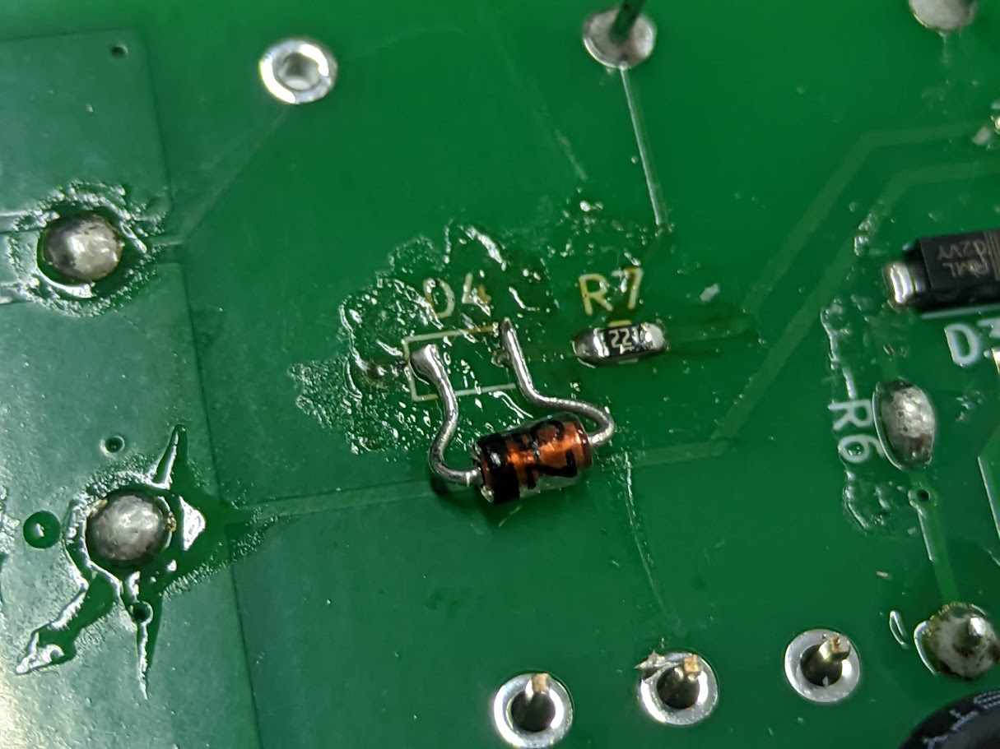
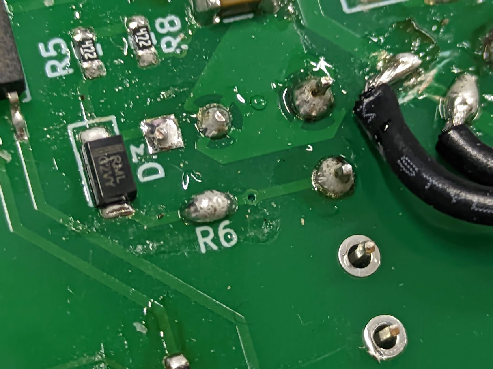
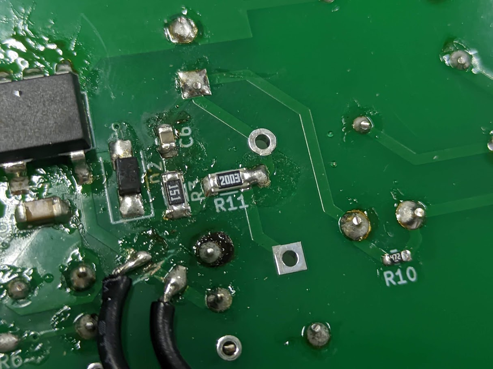

# FlybackUSBCharger
本リポジトリはイチケンが以下の動画で製作した自作フライバックコンバータ回路のリポジトリである。  
  
## 要件
- フライバックコンバータを利用した自作USB充電器である。  
- AC100Vを入力すると、DC5V1.5AをUSB TypeCコネクタから出力する。  
- スイッチングICにはNY-278を使用する。  

## 組み立て手順
### 1.裏面の表面実装部品を実装する
使用する部品は回路図に従う。なお、仕様変更により以下の部品実装に変更がある  
#### ツェナーダイオード(D4)
  
電圧フィードバック用のツェナーダイオードは(なぜか)5.1Vを使用する必要がある。  
基板上のフットプリントはSOD-323になっているので、脚を短く切って曲げて実装する。  
#### 抵抗(R6)
R6は実装する必要がないため、はんだで短絡しておく。  
  
#### スナバ回路のツェナー(VR1)
基本的に実装不要。  
ジャンパ用のパッドが配置してあるため、R11のパッドにブリッジしておく。  
  

### 2.トランス2次側のUSBコントローラの動作を確認する
>[!NOTE]
>表面の装入部品を実装してしまうとUSBコントローラIC周りの修正が難しくなるため、表面実装部品の実装が完了した時点でUSBコントローラの動作を確認する。  

まず表面にUSBコネクタのみ実装する。  
USBコネクタにケーブルと適当なデバイスを接続し、テストポイント"5V","GND"に直流安定化電源で5Vを入力する。
USBから正常に5Vが出力されていることを確認する。  
5Vが正常に出力されていない場合、USBコントローラの実装ではんだ不良が起きている可能性が高い。  
リフロープレートなどを利用して修正する。

### 3.表面の装入部品を実装する

