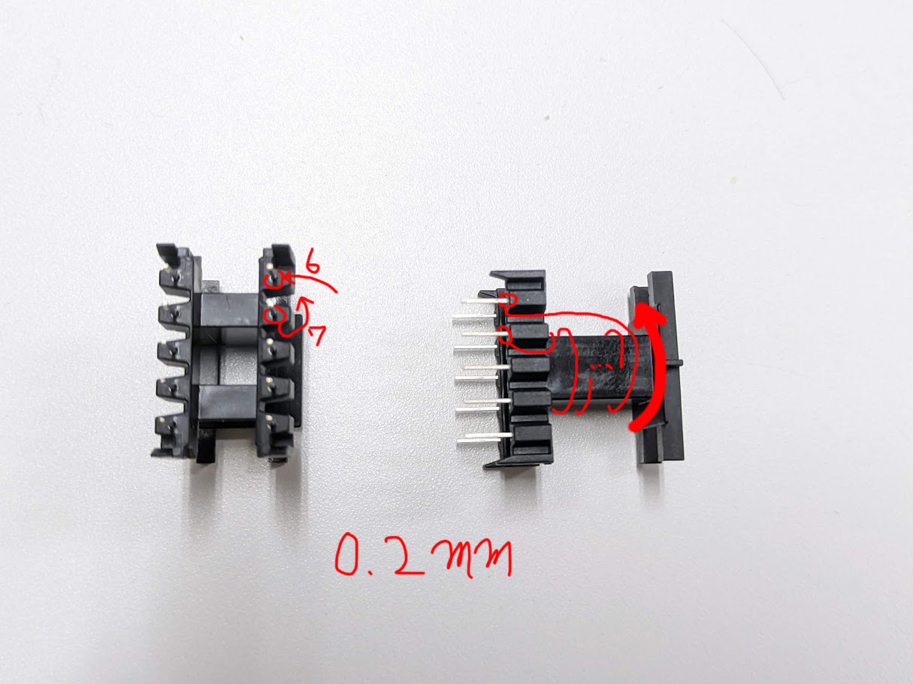
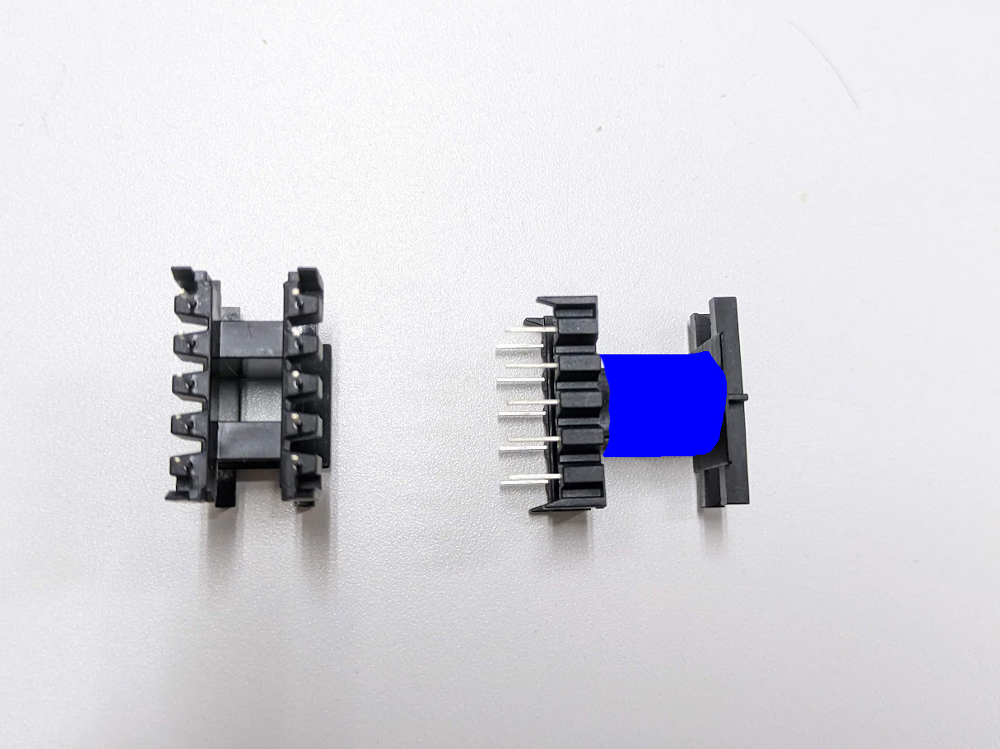
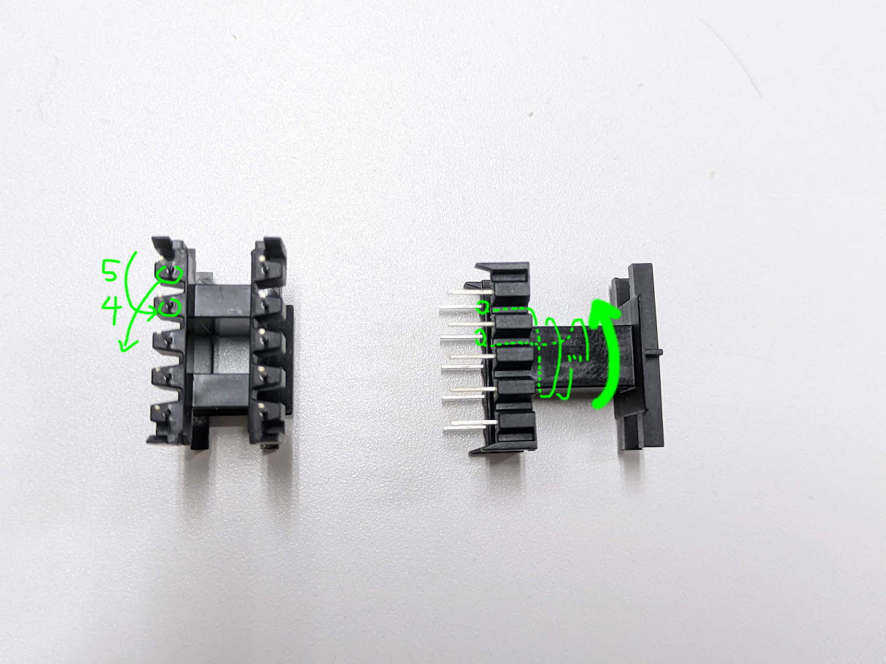
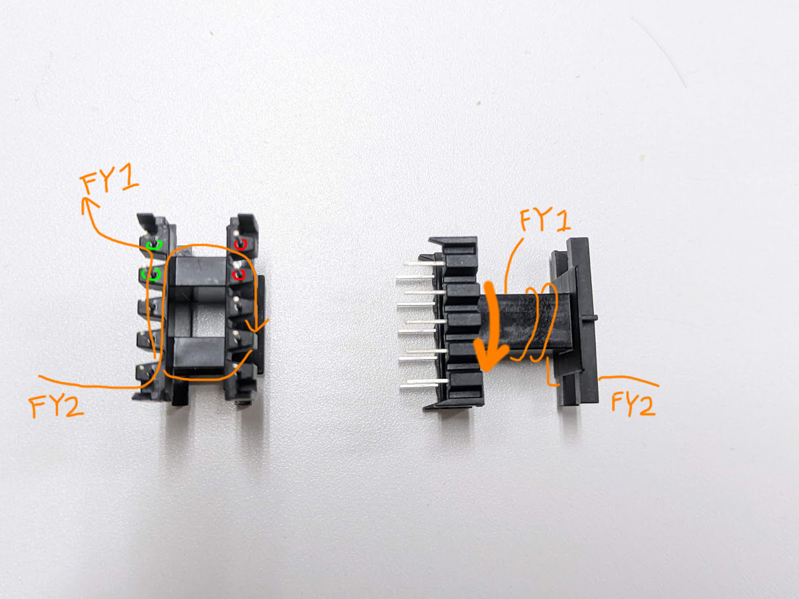
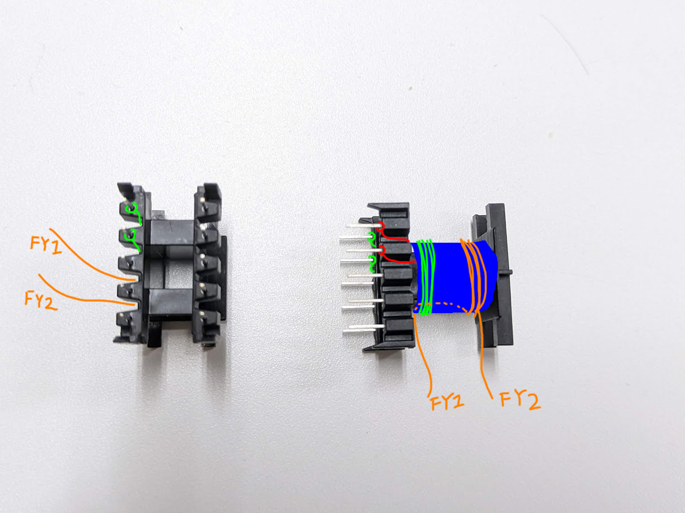

# FlybackUSBCharger
本リポジトリはイチケンが以下の動画で製作した自作フライバックコンバータ回路のリポジトリである。  
  
## 1.要件
- フライバックコンバータを利用した自作USB充電器である。  
- AC100V(50,60Hz)を入力すると、DC5V1.5AをUSB TypeCコネクタから出力する。  
- スイッチングICにはNY-278を使用する。  

## 2.組み立て手順
### 2.1.裏面の表面実装部品を実装する
使用する部品は回路図に従う。なお、仕様変更により以下の部品実装に変更がある  
#### ツェナーダイオード(D4)
  
電圧フィードバック用のツェナーダイオードは(なぜか)5.1Vを使用する必要がある。  
基板上のフットプリントはSOD-323になっているので、脚を短く切って曲げて実装する。  
#### 抵抗(R6)
R6は実装する必要がないため、はんだで短絡しておく。  
  
#### スナバ回路のツェナー(VR1)
基本的に実装不要。  
ジャンパ用のパッドが配置してあるため、R11のパッドにブリッジしておく。  
  

### 2.2.トランス2次側のUSBコントローラの動作を確認する
>[!NOTE]
>表面の挿入部品を実装してしまうと、リフロープレートを使ったUSBコントローラIC周りの修正が難しくなるため、表面実装部品の実装が完了した時点でUSBコントローラの動作を確認する。  

まず表面にUSBコネクタのみ実装する。  
USBコネクタにケーブルと適当なデバイスを接続し、テストポイント"5V","GND"に直流安定化電源で5Vを入力する。
USBから正常に5Vが出力されていることを確認する。  
5Vが正常に出力されていない場合、USBコントローラの実装ではんだ不良が起きている可能性が高い。  
リフロープレートやヒートガンなどを利用して修正する。

### 2.3.トランスを作成する
今回使用するトランスの部品は以下の通りである。  
- フェライトコア  
[B66311GX187](https://www.mouser.jp/ProductDetail/EPCOS-TDK/B66311GX187?qs=wDNl1cNI0GtTIP5GzW5pcg%3D%3D)  
サイズ: E20/10/6  
材質:N87
- ボビン  
[B66206W1110T001](https://www.mouser.jp/ProductDetail/EPCOS-TDK/B66206W1110T001?qs=fdZXMuEuwMyuPKYs5N%2FbLQ%3D%3D)  
- UEW
0.2mm, 0.7mm

以下の図に従ってUEWを巻く
#### 2.3.1.一次側巻線
pin7から巻き始め、図で示された方向に80回巻く。  
巻き終わりはpin6に留める。  
  

#### 2.3.2.テープ留め
幅12mmに切ったトランス用の絶縁テープを2週巻く
  

#### 2.3.3.補助巻線
pin5から巻き始め、図で示された方向に8回巻く。  
巻き終わりはpin4に留める。  
  

#### 2.3.4.二次側巻線
図で示された方向に8回巻く。  
巻き始め、巻き終わりはピンには留めず、30mmほど余らせておく。  
巻き始めをFY2、巻き終わりをFY1とする。  
  

#### 2.3.5.テープ留め
ここまでの手順が正しく完了されていれば、以下の図のようになっている。  
  

幅12mmに切ったトランス用の絶縁テープを2週巻く
  

#### 2.3.6.フェライトコア
フェライトコアを固定する。  
接触面にはテープを1層貼ってインダクタンスを調整する。  
1次側で1.5mH程度あればよい。

### 2.4.表面の挿入部品を実装する
VR1は先述の通り実装しない。  
トランスはFY1,2をそれぞれ基板上の対応したスルーホールへ接続する。

## 3.動作確認
"AC IN"のテストポイントにAC100V(50,60Hz)を入力し、以下の項目を確認する。  
- テストポイント"DRAIN"の電圧を観察し、定常的にスイッチング動作をしているか確認する。  
周期が一定にならないのは正常動作である。  
1秒程度でスイッチングが止まり、数秒後に再開する動作を繰り返すようであれば、過電流保護が作動している。  

- 二次側のテストポイント"5V","GND"に電子負荷を接続し、電流を引いてみる。  
負荷電流を初めは低く、少しづつ大きくしていって、動作を確認する。  
2A程度までは出力可能であることを確認しているが(それ以上は未確認)、それよりも低い値で過電流保護が作動するなどした場合はトランスの設計に問題がある可能性が高い。  
定格上は16Wまで出力可能である。  

- USBコネクタに適当なデバイスを接続し、給電されることを確認する。  
スマートフォンの充電程度なら問題なく可能なはずである。  
念のため、最初の実験でいきなり高価なデバイスを接続することは推奨しない。  

>[!NOTE]
>トランスとスイッチングICの仕様上は、AC85~265Vの入力が可能である。(未検証)  

## 4.現在確認されている不具合
- 負荷をかけるとトランスから可聴域の音が出る。